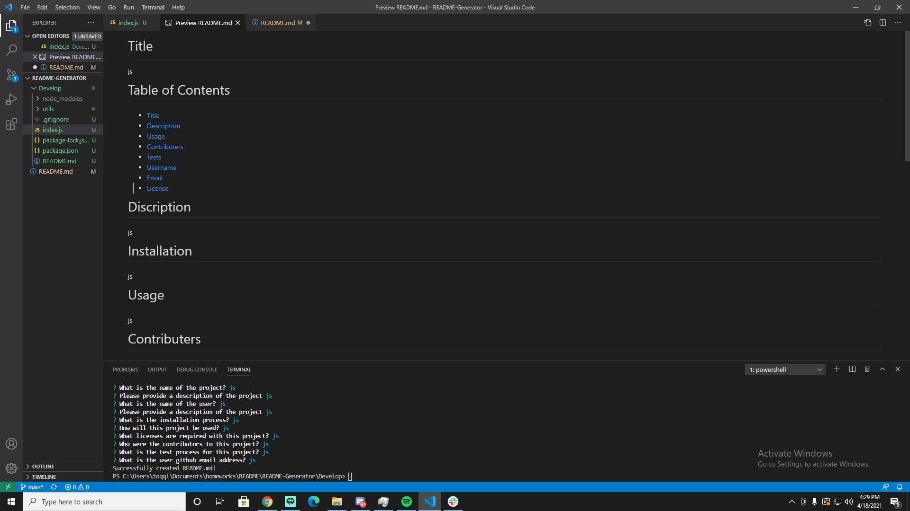
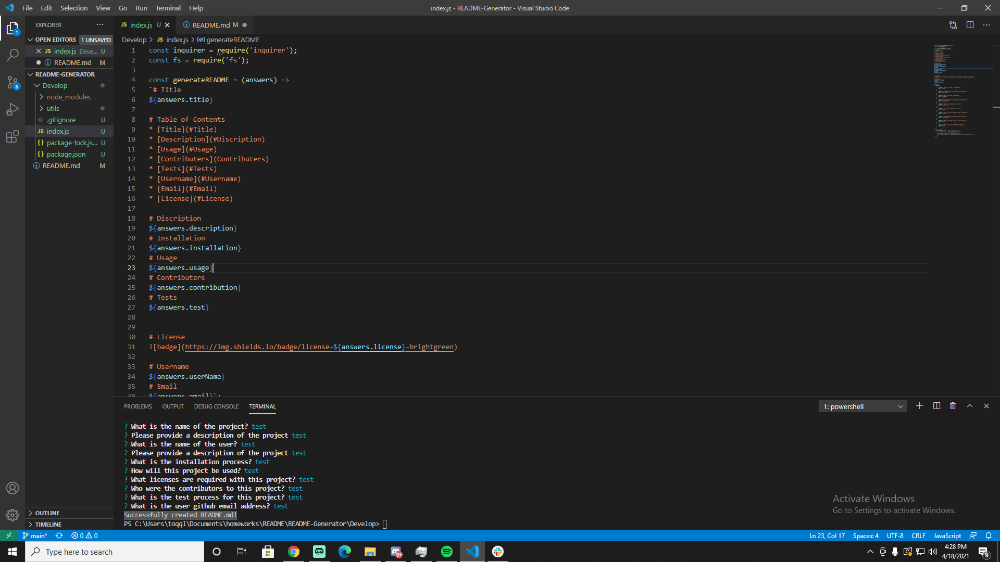

# For this project our client wanted a high-quality README generator.

# Using node index.js, we promt the user to fill out the details of their project.

# After the client has inputted their information, we generator a README file using javascript.

# We have also included a tutorial video showing how to use the application. 

